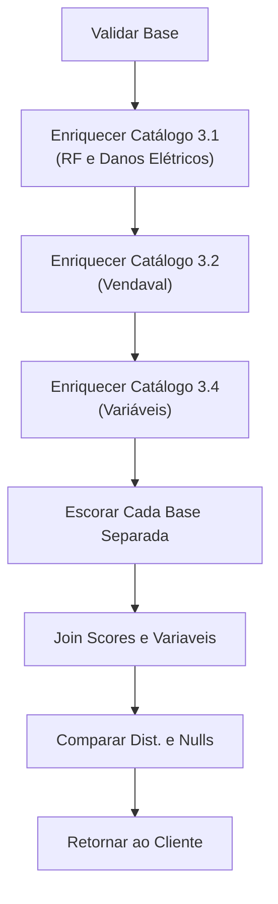

---
aliases:
  - Property HDI
  - Property PJ HDI
tags:
  - processos
  - produtos
---
---
## Resumo

Para o enriquecimento do catálogo de property da HDI primeiramente deve-se validar a base verificando se todas as colunas necessárias (CNPJ, CEP e Data) estão presentes, rodar os scripts no [Postman](Postman.md) dos catálogos [3.1](Catálogos%20PJ.md) para RF e Danos Elétricos e [3.2](Catálogos%20PJ.md) para Vendaval, além disso rodar o [3.4](Catálogos%20PJ.md) para retorar as variáveis que eles necessitam (PORTE, SCORE_RISCO_GEORREFERENCIADO, TEMPO_ATIVIDADE, SECAO_CNAE) pois é o catálogo mais atualizado.

Após rodar os enriquecimentos escoram-se as bases correspondentes de cada um com os modelos ([ONNX](ONNX.md)) também correspondentes. Após a escoragem precisa-se dar um join nas 3 bases para criar a base para o retorno e comparar a distribuição dos scores e o percentual de nulo das variáveis.

## Fluxograma

