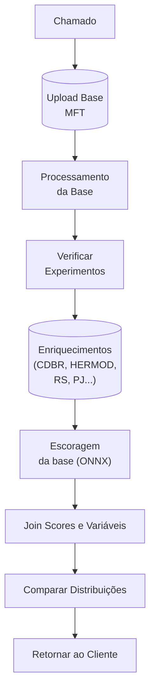
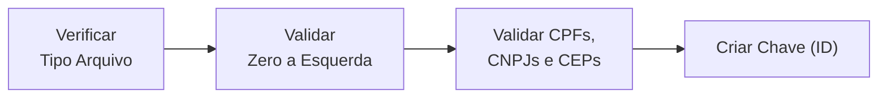

---
aliases:
  - Enrichment
tags:
  - processos
---
---
## Conceito

Frequentemente os clientes fazem abrem chamados (Jira e Topdesk) para enriquecimento de bases contendo CPFs ou CNPJs, esses enriquecimentos trazem scores de vários tipos (sinistro, RF, conversão, etc...). Para checar as informações que dos enriquecimentos para cada cliente deve-se checar a tabela de [Experimentos](https://docs.google.com/spreadsheets/d/1MnY-KUY6qMzgbX2HjRPz1qB6zhwzuN-DbQJWAhXvwEA/edit?gid=0#gid=0) caso seja um cliente novo que não tenha nenhum experimento deve-se utilizar os modelos de [Prateleira](https://docs.google.com/spreadsheets/d/1hzweUnaGSMJ3Mw0Y1G-kSS-ndYqDCNflfTAzLvyR-Is/edit?gid=0#gid=0). Para realizar esses enriquecimentos utilizam-se scripts do [Spark](Spark.md)

## Prazo de Retorno

Normalmente quando os enriquecimentos não necessitam de consultas com parceiros (Quod, Equifax e B3) o prazo padrão de retorno é de **3 dias úteis**

| Parceiro    | Prazo      |
| ----------- | ---------- |
| Equifax, B3 | 1 semana   |
| Quod        | > 1 semana |

## Enriquecimentos com Alvo

Para enriquecimentos de bases com target, precisa-se comparar o [KS](Teste%20KS.md)

## Passo-a-Passo

1. Cliente solicita um enriquecimento através de um chamado (Jira, TopDesk), ou email
2. Upload da base do cliente
   - Baixar a base enviada pelo cliente através do [MFT](https://mft.neurotech.com.br/webclient/Login.xhtml) (importante que a base esteja no formato csv)
   - Fazer upload da base no S3 (renomear e converter para bz2)
     ```python
     bzip2 -zk filename
     ```
3. Processamento da base
   - CEP, CPF e CNPJ devem ser do tipo *long int*
   - Validar CPFs ou CNPJs (zero a esqueda, cpfs válidos, formato de data)
   - Criar chave (ID)
   - Salvar base no Glue e S3
4. Checamos se o cliente já tem [Experimentos](https://docs.google.com/spreadsheets/d/1MnY-KUY6qMzgbX2HjRPz1qB6zhwzuN-DbQJWAhXvwEA/edit?gid=0#gid=0)
5. Caso não existam experimentos utilizar modelo de [Prateleira](https://docs.google.com/spreadsheets/d/1hzweUnaGSMJ3Mw0Y1G-kSS-ndYqDCNflfTAzLvyR-Is/edit?gid=0#gid=0)
6. Enriquecer conforrme o experimento (CDBR, RS, HERMOD, Empresarial, CSCORE...)
7. Join das bases enriquecidas com a base original
8. Escorar base com modelo
9. Join dos scores + base original + variáveis (caso necessário)
10. Comparar distribuições dos scores e percentual de nulos
11. Retornar ao cliente

### Fluxogramas

#### Fluxograma Geral



#### Fluxograma Processamento da Base



## Avaliação

- Missing de variáveis
- Missing por safra
- KS
- KS por Safra

## Obs

Para salvar arquivos pontuais nos buckets do S3 utiliza-se o **sandbox**, já para arquivos que importantes **seguros**

Para checar os significados de variáveis checar o [Catálogo](https://drive.google.com/drive/u/0/folders/1PZKwA3aKJPV-sj9IbLmwhMrZuZTGU3i5) ou [Neurolake](https://neurotech.neurolake.io/plataforma/times/Seguros/enriquecimento?tab=2)
