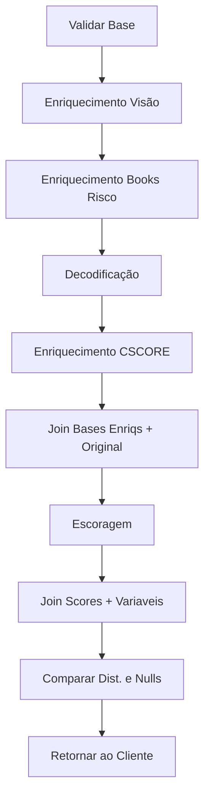

---
aliases:
  - Property TOKIO
  - Property PF TOKIO
tags:
  - processos
  - produtos
---
---
## Resumo

Para o enriquecimento do property pf de fiança locatícia da Tokio primeiramente deve-se validar a base verificando se todas as colunas necessárias (CNPJ, CEP e Data) estão presentes, em seguida a base é enriquecida através de uma DAG do Airflow (modelo antigo). Com a base enriquecida precisa-se excluir as colunas abaixo:

```python
cols = [ 'MEDIA_EXPOSICAO_M24_CEP','MEDIA_PREMIO_M24_CEP','SUM_FREQ_SIN1_M24_CEP','MEDIA_INDENIZ1_M24_CEP','SUM_FREQ_SIN23_M24_CEP','MEDIA_INDENIZ23_M24_CEP','SUM_FREQ_SIN4_M24_CEP','MEDIA_INDENIZ4_M24_CEP','SUM_FREQ_SIN9_M24_CEP','MEDIA_INDENIZ9_M24_CEP','SUM_FREQ_SIN1_M18_IDADE','SUM_FREQ_SIN2_M18_IDADE','SUM_FREQ_SIN3_M18_IDADE','SUM_FREQ_SIN4_M18_IDADE','SUM_FREQ_SIN9_M18_IDADE','MEDIA_EXPOSICAO1_M18_IDADE','MEDIA_EXPOSICAO2_M18_IDADE','MEDIA_PREMIO1_M18_IDADE','MEDIA_INDENIZ1_M18_IDADE','MEDIA_INDENIZ2_M18_IDADE','MEDIA_INDENIZ3_M18_IDADE','MEDIA_INDENIZ4_M18_IDADE','MEDIA_INDENIZ9_M18_IDADE','SUM_FREQ_SIN1_M24_IDADE','SUM_FREQ_SIN2_M24_IDADE','SUM_FREQ_SIN3_M24_IDADE','SUM_FREQ_SIN4_M24_IDADE','SUM_FREQ_SIN9_M24_IDADE','MEDIA_EXPOSICAO1_M24_IDADE','MEDIA_EXPOSICAO2_M24_IDADE','MEDIA_PREMIO1_M24_IDADE','MEDIA_INDENIZ1_M24_IDADE','MEDIA_INDENIZ2_M24_IDADE','MEDIA_INDENIZ3_M24_IDADE']
```

A nova base é enriquecida com os books de variáveis de risco, para isso precisa-se passar um script no postman utilizando o link do notebook. Essas variáveis são decodificadas.

Uma outra base (com CPF, CEP e DATA) é utilizada para o enriquecimento via CSCORE (notebook) e então é feito um join com a base dos books e do CSCORE. Esta base então é escorada através de um modelo [ONNX](ONNX.md). Por fim é feito um join dos scores + variáveis ('NHPACPF012N12V02': 'FLAG_PROGRAMAS_SOCIAIS' e 'PSMCCPF001C12V01': 'BUSCA_POR_CREDITO_12'), verifica-se a distribuição do score e o percentual de nulos das variáveis

## Fluxograma


## Script Visão

Endpoint: https://airflow.neurolake.io/api/experimental/dags/segurosauto_visao_seguros/dag_runs

```javascript
{
    "conf": "{\"cluster_name\":\"VISAO_SEGUROS=+=TOKIO\",\"source\":\"s3://dev-neurolake-sftp/seguros-auto/dev-seguros/Bases/LOFT/2024-05-29/database/original/envio_neurotech.csv\", \"source_delimiter\":\",\",\"source_encoding\":\"utf-8\",\"destination\":\"base_loft_fianca\", \"client\":\"HDI\", \"column_chave\":\"CHAVE\",\"column_cpf\":\"CPF\", \"column_cep\":\"cep\", \"column_marca\":\"null\", \"column_modelo\":\"null\", \"column_ano_fabricacao\":\"null\",\"column_inicio_vigencia\":\"requested_at\", \"mascara_inicio_vigencia\":\"yyyy-MM-dd\",\"column_idade_veiculo\":\"null\", \"column_alvo_rf\":\"null\",\"column_alvo_sinistro\":\"null\", \"column_alvo_conversao\":\"null\", \"geo_version\":\"old\", \"keep_cluster\":\"False\", \"task_process\":\"visaoseguros\", \"database\": \"seguros\"}"
}
```

## Script Books Risco